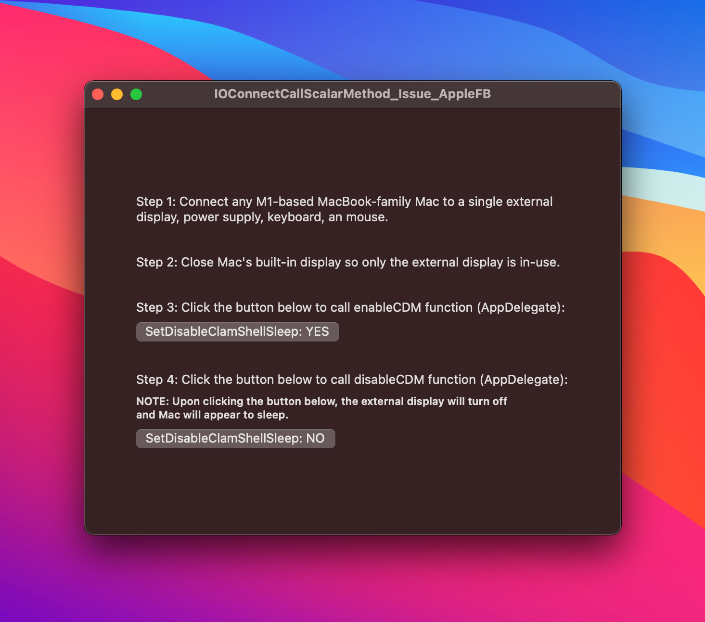

# IOConnectCallScalarMethod_Issue_AppleFB
Code example for Apple Feedback Issue FB9101664

**ISSUE** 
• M1-Based MacBook-family Macs enter sleep mode unexpectedly when making IOConnectCallScalarMethod call.  
 
**REQUIREMENTS** 
• M1-Based MacBook-family Mac (MacBook Air, MacBook Pro 13" - Not iMac or Mac Mini) 
• Connected to an external display (USB-C or Thunderbolt 3/4), with power delivery 
• Connected USB or Bluetooth keyboard and mouse/trackpad 
 
**STEPS TO REPRODUCE**  
• [Download](https://github.com/x74353/IOConnectCallScalarMethod_Issue_AppleFB/archive/refs/heads/main.zip) and run sample project 
• Follow steps in app's user interface
  

  
**EXPECTED RESULTS** 
• M1-based Mac should not sleep when IOConnectCallScalarMethod is executed, this does NOT occur on Intel-based MacBook-family Macs 
• Issue does not occur when using the built-in display alone, or in-conjunction (simultaneous) with the external display 
• Actions/API calls resulting in Mac sleep should be consistent and not dependent on how many displays are connected to Mac 
 
**PROPOSED RESOLUTION** 
• Fix bug, or provide an API to detect situation/apply override (prevent sleep)
